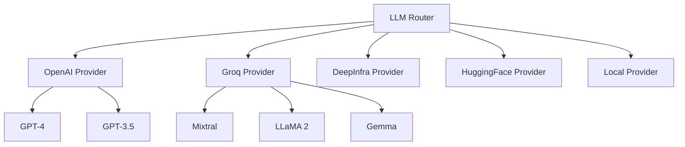
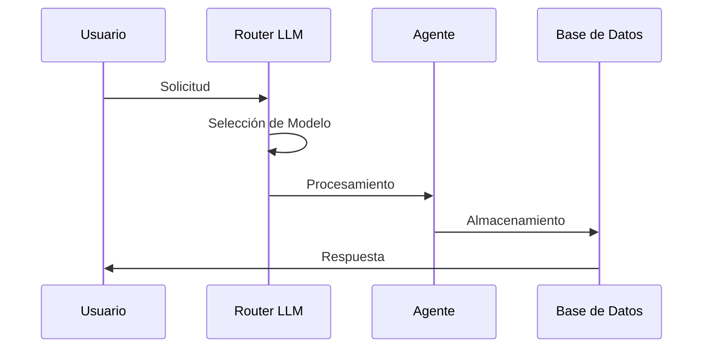
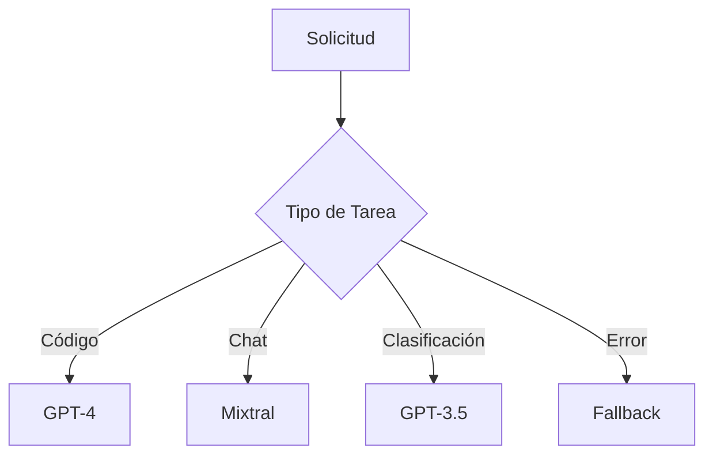

# 🏗️ Arquitectura del Sistema

## 1. Componentes Principales

### 1.1 Sistema Multi-LLM


### 1.2 Estructura de Directorios
```
Knowledge_Acquisition/
├── src/
│   ├── llm/                    # Sistema Multi-LLM
│   │   ├── model_provider.py   # Proveedores de modelos
│   │   ├── llm_router.py      # Enrutamiento inteligente
│   │   └── utils.py           # Utilidades LLM
│   ├── agent/                  # Agentes especializados
│   │   ├── knowledge_scout.py
│   │   ├── fact_validator.py
│   │   ├── knowledge_synthesizer.py
│   │   └── meta_evaluator.py
│   ├── scrapers/              # Extractores de datos
│   └── config.py             # Configuración centralizada
├── scripts/                   # Scripts de utilidad
└── docs/                     # Documentación
```

## 2. Estado Actual del Proyecto

### 2.1 Componentes Implementados ✅
- Sistema Multi-LLM con enrutamiento inteligente
- Soporte para múltiples proveedores (OpenAI, Groq, DeepInfra, HuggingFace)
- Configuración flexible y centralizada
- Sistema de gestión de dependencias
- Scripts de mantenimiento del repositorio

### 2.2 En Desarrollo 🚧
- Integración de modelos locales (llama.cpp)
- Sistema de caché para respuestas
- Monitoreo de costos
- Evaluación automática de respuestas

### 2.3 Planificado 📋
- Balanceo de carga entre modelos
- Más proveedores de LLM
- Sistema de fallback mejorado
- Optimización de costos automática

## 3. Entornos de Desarrollo

### 3.1 knowledge-acquisition (Principal)
- Entorno completo para desarrollo y producción
- Incluye todas las dependencias
- Soporte CUDA/PyTorch
- Procesamiento multimedia

### 3.2 knowledge-acq-test (Testing)
- Entorno ligero para pruebas rápidas
- Dependencias mínimas
- Sin CUDA/PyTorch

## 4. Flujos de Trabajo

### 4.1 Procesamiento de Conocimiento


### 4.2 Selección de Modelo


## 5. Métricas y Monitoreo

### 5.1 Métricas Implementadas
- Tiempo de respuesta por modelo
- Uso de tokens
- Tasa de éxito de solicitudes

### 5.2 Métricas Planificadas
- Costos por modelo/tarea
- Calidad de respuestas
- Eficiencia de caché

## 6. Próximos Pasos

### 6.1 Corto Plazo
1. Implementar sistema de caché
2. Agregar más proveedores
3. Mejorar documentación

### 6.2 Mediano Plazo
1. Integrar modelos locales
2. Implementar balanceo de carga
3. Optimizar costos

### 6.3 Largo Plazo
1. Sistema de auto-mejora
2. Aprendizaje continuo
3. Escalabilidad horizontal
