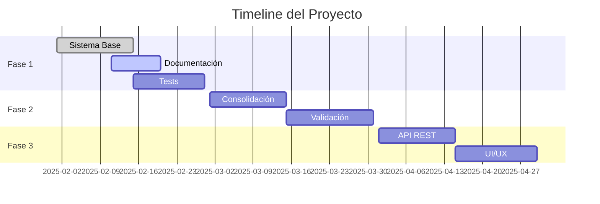

# 🗺️ Roadmap del Proyecto

## 📅 Timeline General

## 🎯 Objetivos por Fase

### Fase 1: Fundamentos (Febrero 2025) 🚧

#### Completado ✅
- [x] Estructura base del proyecto
- [x] Configuración de GitHub
- [x] CI/CD básico
- [x] Documentación inicial

#### En Progreso 🔄
- [ ] Documentación completa
- [ ] Tests unitarios
- [ ] Tests de integración
- [ ] Cobertura de código

#### Pendiente 📋
- [ ] Optimización de performance
- [ ] Logging avanzado
- [ ] Métricas de sistema

### Fase 2: Funcionalidades Core (Marzo 2025)

#### Planificado 📋
1. **Consolidación de Conocimiento**
   - [ ] Sistema de resolución de conflictos
   - [ ] Detección de contradicciones
   - [ ] Validación cruzada

2. **Validación Automática**
   - [ ] Verificación de fuentes
   - [ ] Scoring de confiabilidad
   - [ ] Sistema de feedback

3. **Optimizaciones**
   - [ ] Caché inteligente
   - [ ] Procesamiento paralelo
   - [ ] Reducción de latencia

### Fase 3: Expansión (Abril 2025)

#### Planificado 📋
1. **API REST**
   - [ ] Endpoints CRUD
   - [ ] Autenticación
   - [ ] Rate limiting
   - [ ] Documentación API

2. **Interfaz de Usuario**
   - [ ] Dashboard web
   - [ ] Visualización de conocimiento
   - [ ] Sistema de búsqueda
   - [ ] Analytics

### Fase 4: Avanzado (Mayo 2025+)

#### Planificado 📋
1. **Autonomía**
   - [ ] Auto-descubrimiento
   - [ ] Auto-mejora
   - [ ] Aprendizaje continuo

2. **Escalabilidad**
   - [ ] Sharding
   - [ ] Load balancing
   - [ ] Alta disponibilidad

## 📊 KPIs y Métricas

### Actuales
- Sistema base: 100%
- Documentación: 40%
- Tests: 0%
- Cobertura: 0%

### Objetivos Q1 2025
- Documentación: 100%
- Tests: 80%
- Cobertura: 90%
- Performance: <500ms/query

### Objetivos Q2 2025
- API Uptime: 99.9%
- Latencia: <200ms
- Precisión: >95%
- Usuarios activos: 1000+

## 🛠️ Recursos Necesarios

### Actuales
- GitHub
- OpenAI API
- FAISS
- MkDocs

### Planificados
- CI/CD avanzado
- Monitoreo 24/7
- Infraestructura cloud
- CDN global

## 📝 Notas de Planificación

### Prioridades
1. Completar documentación
2. Implementar tests
3. Mejorar consolidación
4. Desarrollar API

### Consideraciones
- Mantener calidad de código
- Priorizar seguridad
- Documentar todo
- Feedback continuo

## 🔄 Estado de Actualización
- Fecha: 11 de Febrero, 2025
- Sprint: 1
- Estado: En desarrollo
- Progreso general: ~35%
