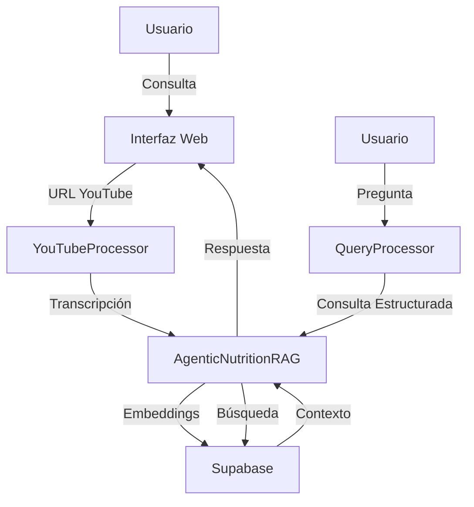

# Diseño del Sistema de Adquisición de Conocimiento Nutricional

## 1. Visión General

Sistema avanzado de adquisición y consulta de conocimiento nutricional que utiliza procesamiento de lenguaje natural y técnicas de RAG (Retrieval-Augmented Generation) para proporcionar respuestas precisas sobre nutrición deportiva.

## 2. Arquitectura del Sistema

### 2.1 Componentes Principales

```
Knowledge_Acquisition/
├── src/
│   ├── agent/
│   │   ├── core/         # Componentes base y utilidades
│   │   ├── interfaces/   # Interfaces de usuario
│   │   └── models/       # Modelos de IA y procesadores
│   ├── auth/            # Autenticación y seguridad
│   └── youtube_processor.py  # Procesamiento de videos
├── app.py              # Aplicación principal
└── docs/              # Documentación
```

### 2.2 Flujo de Datos



## 3. Componentes Detallados

### 3.1 Procesador de YouTube
- Extracción de transcripciones multilingües
- Procesamiento asíncrono de metadata
- Manejo robusto de errores
- Integración con API de YouTube

### 3.2 Sistema RAG (AgenticNutritionRAG)
- Modelo base: GPT-3.5-turbo
- Embeddings semánticos
- Procesamiento en dos fases:
  1. Búsqueda vectorial inicial
  2. Refinamiento por relevancia

#### 3.2.1 Procesamiento de Consultas
- Extracción de palabras clave
- Eliminación de stop words
- Análisis de intención
- Estructuración de consultas

#### 3.2.2 Búsqueda de Contexto
- Fragmentación inteligente de texto
- Sistema de puntuación multifactorial:
  - Coincidencia de palabras clave
  - Similitud semántica
  - Longitud óptima
  - Coherencia contextual

### 3.3 Base de Conocimiento (Supabase)
- Almacenamiento vectorial
- Búsqueda por similitud
- Indexación eficiente
- Caché de resultados

## 4. Procesamiento Inteligente

### 4.1 Extracción de Conocimiento
- Segmentación de video
- Identificación de temas clave
- Extracción de conceptos
- Relaciones semánticas

### 4.2 Generación de Respuestas
- Contextualización inteligente
- Verificación de fuentes
- Adaptación al usuario
- Explicaciones estructuradas

## 5. Mejoras Implementadas

### 5.1 Procesamiento de Videos
- [x] Extracción robusta de transcripciones
- [x] Manejo de múltiples idiomas
- [x] Procesamiento paralelo
- [x] Gestión de errores

### 5.2 Sistema RAG
- [x] Fragmentación inteligente
- [x] Puntuación avanzada
- [x] Búsqueda en dos fases
- [x] Contextualización mejorada

### 5.3 Interfaz de Usuario
- [x] Diseño responsive
- [x] Feedback en tiempo real
- [x] Manejo de errores amigable
- [x] Historial de consultas

## 6. Próximas Mejoras

### 6.1 Corto Plazo
- [ ] Implementar caché de embeddings
- [ ] Mejorar extracción de palabras clave
- [ ] Añadir análisis de sentimiento
- [ ] Optimizar búsqueda vectorial

### 6.2 Largo Plazo
- [ ] Implementar aprendizaje continuo
- [ ] Añadir verificación de fuentes
- [ ] Expandir base de conocimiento
- [ ] Mejorar personalización

## 7. Consideraciones Técnicas

### 7.1 Rendimiento
- Optimización de consultas
- Caché estratégico
- Procesamiento asíncrono
- Gestión de recursos

### 7.2 Seguridad
- Validación de entrada
- Sanitización de salida
- Gestión segura de API keys
- Control de acceso

### 7.3 Escalabilidad
- Diseño modular
- Componentes desacoplados
- Interfaces extensibles
- Configuración flexible

## 8. Documentación Adicional

- [README.md](../README.md): Guía de inicio rápido
- [API.md](API.md): Documentación de la API
- [CONTRIBUTING.md](CONTRIBUTING.md): Guía de contribución
