# Diagrama del Esquema de Base de Datos

```mermaid
erDiagram
    knowledge_items ||--o{ video_knowledge_items : "extends"
    video_knowledge_items ||--o{ knowledge_fragments : "contains"
    knowledge_fragments ||--o{ video_frames : "has"
    video_knowledge_items ||--o{ video_citations : "references"
    video_frames ||--o{ video_citations : "referenced_by"

    knowledge_items {
        bigint id PK
        text source_url
        text concept
        text content
        float evidence_score
        float novelty_score
        jsonb reference_list
        vector embedding
        text category
        timestamptz created_at
    }

    video_knowledge_items {
        uuid id PK
        bigint knowledge_item_id FK
        text summary
        text[] main_topics
        jsonb metadata
        jsonb quality_metrics
        timestamptz processed_at
        timestamptz updated_at
        jsonb video_metadata
        timestamptz created_at
    }

    knowledge_fragments {
        uuid id PK
        uuid video_item_id FK
        text content
        float start_time
        float end_time
        text[] keywords
        text[] topics
        float confidence_score
        vector(384) embedding
        integer frame_count
        boolean scene_change
        jsonb visual_features
        vector(512)[] frame_embeddings
        text[] dominant_colors
        float motion_intensity
        timestamptz created_at
    }

    video_frames {
        uuid id PK
        uuid fragment_id FK
        float timestamp
        text frame_path
        vector(512) embedding
        jsonb objects_detected
        float scene_score
        jsonb visual_features
        timestamptz created_at
    }

    video_citations {
        uuid id PK
        uuid video_item_id FK
        text text
        text source_url
        text context
        float timestamp
        uuid frame_reference FK
        timestamptz accessed_date
        timestamptz created_at
    }
```

## Notas sobre el Diagrama

### Relaciones
- `knowledge_items` → `video_knowledge_items`: Extensión para videos
- `video_knowledge_items` → `knowledge_fragments`: Segmentación temporal
- `knowledge_fragments` → `video_frames`: Frames clave
- `video_knowledge_items` → `video_citations`: Referencias
- `video_frames` → `video_citations`: Referencias precisas

### Tipos Especiales
- `vector(384)`: Embeddings de texto
- `vector(512)`: Embeddings visuales
- `jsonb`: Datos estructurados flexibles
- `text[]`: Arrays de texto para etiquetas

### Índices Importantes
- Vectoriales: `embedding` en fragments y frames
- Temporales: `(start_time, end_time)` y `timestamp`
- Relacionales: Referencias entre tablas
