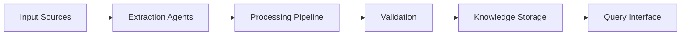

# Knowledge Acquisition System Architecture

## Overview

The Knowledge Acquisition System is a modular, scalable platform designed to extract, process, and store knowledge from various sources. The system uses a combination of specialized agents and a robust pipeline architecture to ensure efficient and reliable knowledge processing.

## Core Components

### 1. Agent System

#### Base Agent
- Abstract base class defining core agent functionality
- Task processing and validation capabilities
- State management and resource handling

#### Specialized Agents

##### RAG Agent
- Retrieval Augmented Generation for knowledge processing
- Multi-step reasoning with confidence scoring
- Knowledge validation and enrichment

##### YouTube Agent
- Video content extraction and processing
- Caption and audio transcription
- Visual content analysis

##### Web Research Agent
- Web content extraction and validation
- Link following and depth control
- Content relevance scoring

##### GitHub Agent
- Code repository analysis
- Documentation extraction
- Activity and contribution analysis

### 2. Pipeline System

#### Pipeline Processor
- Modular processing stages
- Caching and optimization
- Error handling and recovery

#### Processing Nodes
- Stage-specific processing
- Input/output validation
- Resource management

### 3. Integration System

#### Agent Coordinator
- Agent registration and lifecycle management
- Task distribution and monitoring
- Result aggregation

#### Monitoring System
- Real-time metrics collection
- Alert management
- Performance tracking

## Data Flow



## Key Features

### 1. Modularity
- Independent agent implementation
- Pluggable pipeline stages
- Configurable processing flows

### 2. Scalability
- Asynchronous processing
- Resource pooling
- Distributed execution support

### 3. Reliability
- Comprehensive error handling
- Data validation at each stage
- Automatic retry mechanisms

### 4. Monitoring
- Real-time performance metrics
- Alert system
- Debug logging

## Configuration

### System Configuration
```yaml
api:
  openai_api_key: ${OPENAI_API_KEY}
  github_token: ${GITHUB_TOKEN}

storage:
  vector_store_path: "./data/vector_store"
  knowledge_base_path: "./data/knowledge_base"

processing:
  batch_size: 32
  max_workers: 4
```

### Agent Configuration
```yaml
rag_agent:
  model_name: "gpt-4"
  max_documents: 5
  temperature: 0.7

youtube_agent:
  max_videos: 100
  supported_formats: ["mp4", "webm"]
```

## Development Guidelines

### 1. Code Structure
- Clear separation of concerns
- Type hints and validation
- Comprehensive documentation

### 2. Testing
- Unit tests for components
- Integration tests for workflows
- Performance benchmarks

### 3. Monitoring
- Metric collection
- Alert configuration
- Log management

## Deployment

### Requirements
- Python 3.8+
- CUDA support (optional)
- Redis for caching
- Vector store backend

### Environment Setup
```bash
# Create conda environment
conda create -n knowledge-acquisition python=3.8

# Install dependencies
pip install -r requirements.txt

# Configure environment variables
cp .env.example .env
```

### Running the System
```bash
# Start monitoring
python -m core_system.monitoring.monitor

# Start agent coordinator
python -m core_system.integration.coordinator

# Start processing pipeline
python -m core_system.pipeline.processor
```

## Future Enhancements

### 1. Additional Agents
- Academic paper analysis
- Social media monitoring
- Dataset integration

### 2. Advanced Features
- Active learning integration
- Cross-validation of knowledge
- Automated knowledge graph construction

### 3. System Improvements
- Enhanced caching strategies
- Distributed processing
- Real-time analytics dashboard
