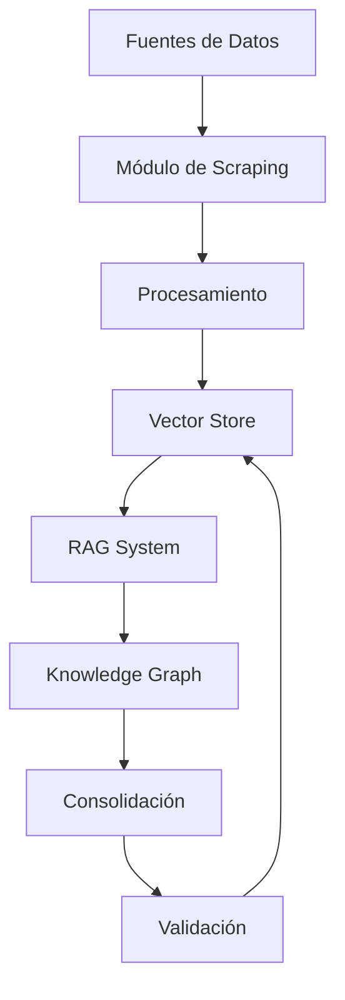
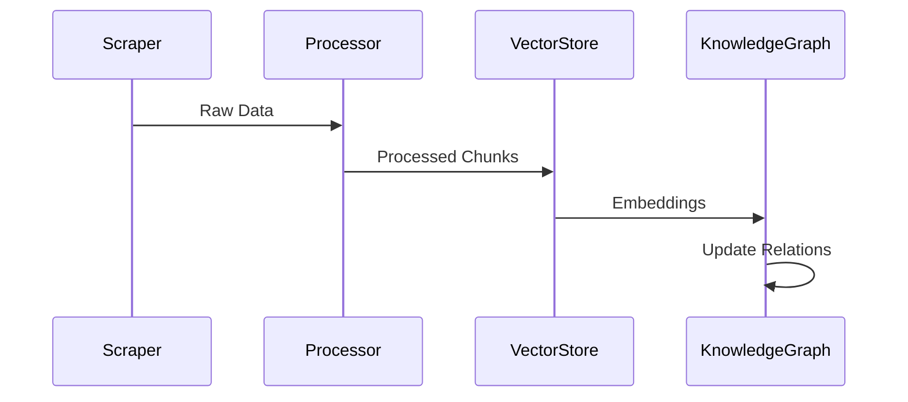
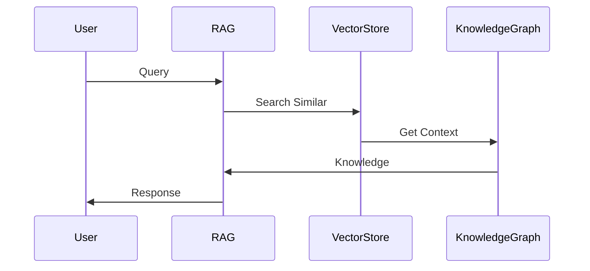

# Arquitectura del Sistema

## Diseño General

## Componentes Implementados

### 1. Módulo de Scraping 
- `BaseScraper`: Interfaz abstracta base
- `AdvancedCrawler`: Implementado
- `YouTubeScraper`: Implementado
- `RateLimiter`: Implementado

### 2. Vector Store 
- FAISS para indexación
- OpenAI para embeddings
- Sistema de persistencia

### 3. Sistema RAG 
- `KnowledgeAgent`: Base implementada
- `KnowledgeConsolidator`: En desarrollo
- Integración con OpenAI

### 4. Knowledge Graph 
- Estructura base definida
- Relaciones semánticas pendientes
- Sistema de confianza pendiente

## Flujos de Datos

### 1. Adquisición de Conocimiento

### 2. Consulta y Respuesta

## Detalles Técnicos

### Implementado 
- FAISS para vectores
- OpenAI para LLM
- GitHub Actions para CI/CD
- MkDocs para documentación

### En Desarrollo 
- Tests unitarios
- Sistema de caché
- Validación automática
- Métricas de calidad

### Pendiente 
- Sharding de datos
- Procesamiento distribuido
- Sistema de plugins
- API REST

## Escalabilidad

### Implementado 
- Chunking inteligente
- Rate limiting
- Persistencia de índices

### Planificado 
- Caché distribuida
- Load balancing
- Procesamiento paralelo

## Seguridad

### Implementado 
- Variables de entorno
- Token de GitHub
- Secretos en CI/CD

### Pendiente 
- Autenticación de API
- Encriptación en reposo
- Auditoría de accesos

## Monitoreo

### En Desarrollo 
- Logs de sistema
- Métricas de rendimiento
- Estado de componentes

### Planificado 
- Dashboard de métricas
- Alertas automáticas
- Análisis de tendencias

## Última Actualización
- Fecha: 11 de Febrero, 2025
- Estado: Implementación inicial
- Progreso: ~35% completado
