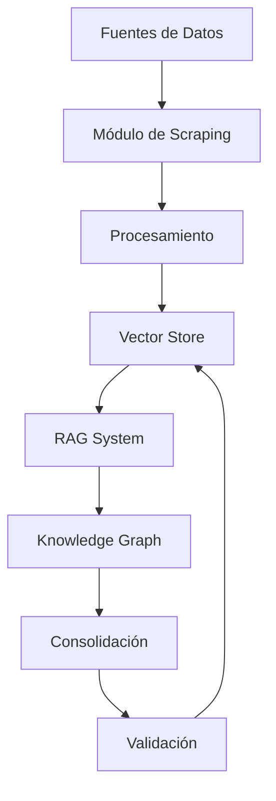
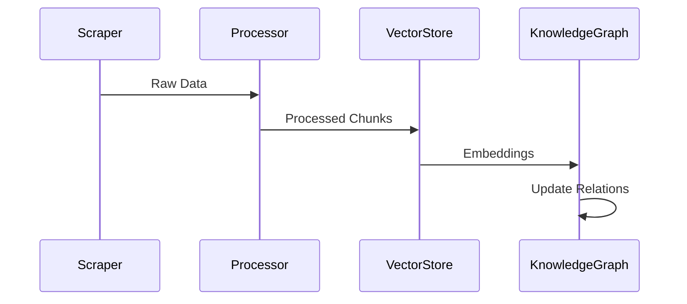
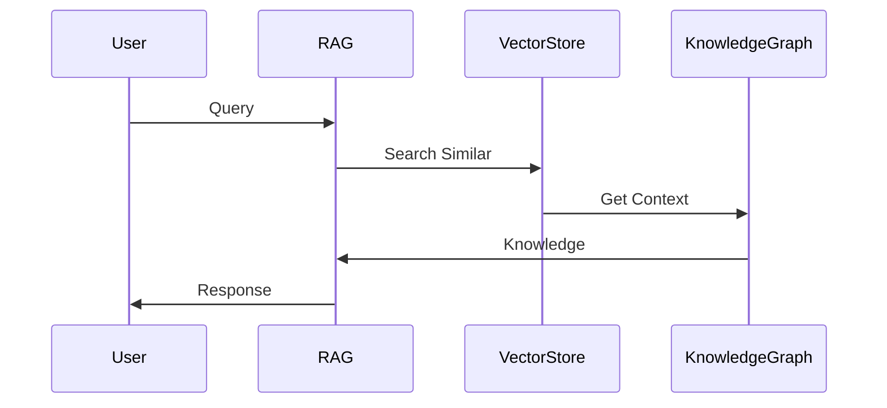
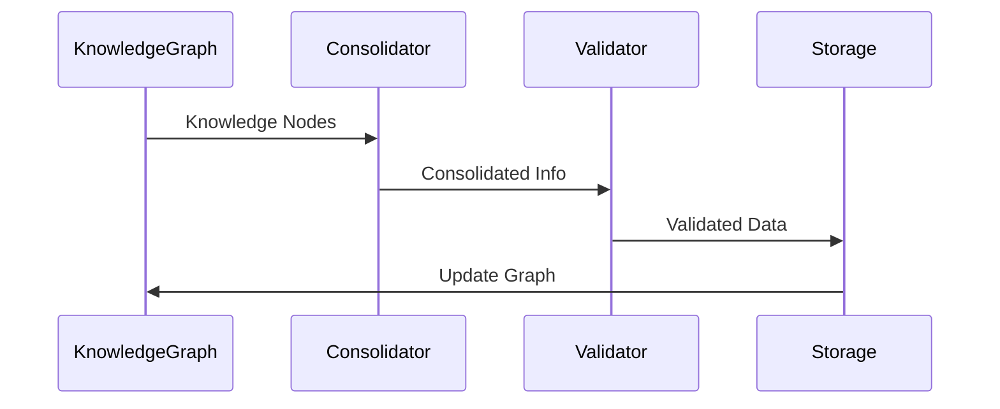

# Arquitectura del Sistema

## 📐 Diseño General

## 🧩 Componentes Principales

### 1. Módulo de Scraping
#### Responsabilidades
- Extracción de datos de múltiples fuentes
- Chunking inteligente
- Rate limiting
- Manejo de errores

#### Implementaciones
- `BaseScraper`: Interfaz abstracta
- `AdvancedCrawler`: Crawler web profesional
- `YouTubeScraper`: Especializado en YouTube
- `WebScraper`: Scraping web general

### 2. Vector Store
#### Características
- Almacenamiento eficiente de embeddings
- Búsqueda por similitud
- Persistencia de índices
- Metadatos enriquecidos

#### Componentes
- FAISS para indexación
- OpenAI para embeddings
- Sistema de caché local

### 3. Sistema RAG
#### Funcionalidades
- Generación de respuestas
- Contextualización
- Citación de fuentes
- Control de calidad

#### Subsistemas
- Prompt engineering
- Gestión de contexto
- Evaluación de respuestas

### 4. Knowledge Graph
#### Estructura
- Nodos de conocimiento
- Relaciones semánticas
- Metadatos y confianza
- Historial de validación

#### Operaciones
- Inserción de nodos
- Actualización de relaciones
- Consultas complejas
- Mantenimiento

## 🔄 Flujos de Datos

### 1. Adquisición de Conocimiento

### 2. Consulta y Respuesta

### 3. Consolidación

## 🛠️ Detalles Técnicos

### Almacenamiento
- FAISS para vectores
- SQLite para metadatos
- Sistema de archivos para caché

### APIs
- OpenAI para LLM
- YouTube Data API
- Web APIs varias

### Concurrencia
- asyncio para I/O
- Procesamiento paralelo
- Rate limiting distribuido

### Seguridad
- Validación de entrada
- Rate limiting
- Manejo seguro de API keys

## 📈 Escalabilidad

### Vertical
- Optimización de memoria
- Procesamiento batch
- Caché inteligente

### Horizontal
- Sharding de índices
- Replicación de conocimiento
- Distribución de carga

## 🔍 Monitoreo

### Métricas
- Latencia de respuesta
- Uso de recursos
- Calidad de respuestas
- Tasa de éxito

### Logging
- Errores y excepciones
- Decisiones del sistema
- Uso de API
- Performance

## 🔒 Seguridad

### Datos
- Encriptación en reposo
- Sanitización de entrada
- Backups regulares

### API
- Autenticación
- Rate limiting
- Validación de tokens

## 🔄 Ciclo de Vida

### Desarrollo
1. Implementación modular
2. Testing exhaustivo
3. Documentación clara
4. Code review

### Despliegue
1. CI/CD pipeline
2. Versionado semántico
3. Rollback plan
4. Monitoreo post-deploy

## 📝 Notas de Implementación

### Mejores Prácticas
- Clean Architecture
- SOLID principles
- Dependency Injection
- Error handling robusto

### Consideraciones
- Mantener bajo acoplamiento
- Facilitar testing
- Documentar decisiones
- Priorizar mantenibilidad
